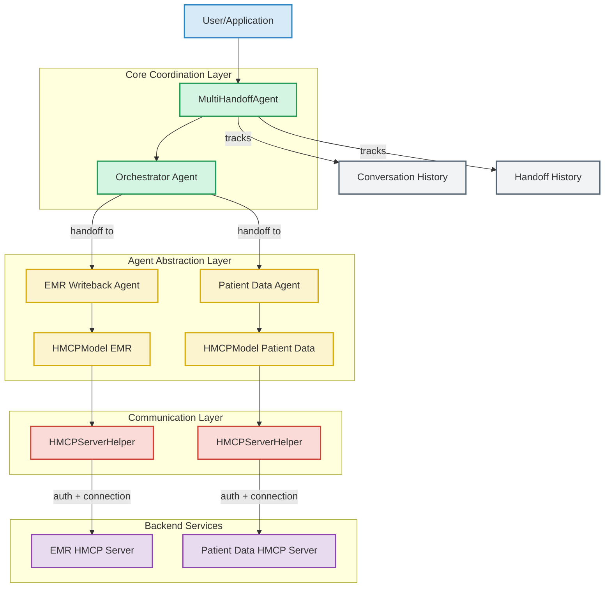
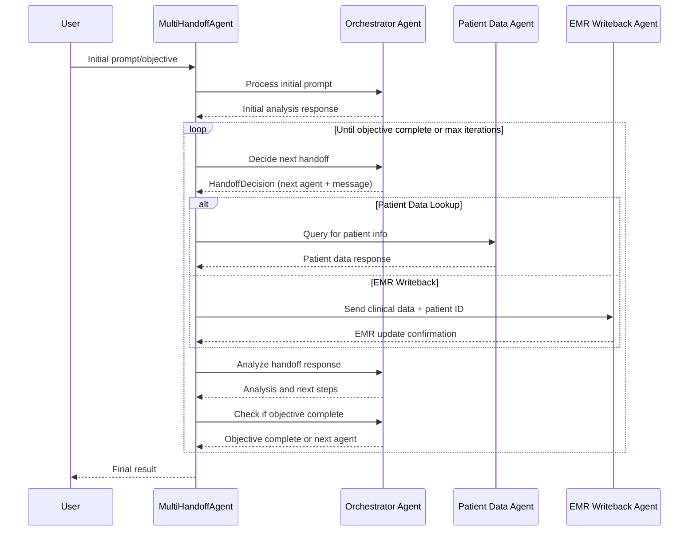

# Multi-Agent Handoff Architecture in HMCP

This document provides a technical overview of the multi-agent handoff architecture implemented in the Healthcare Model Context Protocol (HMCP) framework. The architecture enables complex workflows where multiple specialized AI agents collaborate to complete tasks that require different expertise or access to different healthcare systems.

## Overview

The multi-agent handoff implementation allows:

1. Orchestration of complex workflows between specialized agents
2. Dynamic routing of messages between agents based on context and needs
3. Secure and compliant exchange of healthcare information
4. Stateful tracking of conversation and handoff history

The architecture consists of the following key components:

- **MultiHandoffAgent**: The core coordinator that manages agent handoffs
- **Orchestrator Agent**: The main agent that decides which specialized agent to call
- **Specialized HMCP Agents**: Domain-specific agents (e.g., EMR system, patient data)
- **HMCPServerHelper**: Provides communication with HMCP servers
- **HMCPModel**: Integration with the Agents framework model interface

## Architecture Diagram

The following diagram shows the architectural components and their relationships:

## Sequence Diagram

The following sequence diagram illustrates the flow of a typical multi-agent handoff workflow:

## Components in Detail

### MultiHandoffAgent

The `MultiHandoffAgent` class serves as the orchestrator of the entire workflow. It:

1. Maintains conversation history and state
2. Coordinates communication between agents
3. Decides when to call which specialized agent
4. Tracks progress towards the objective

Key methods:
- `run()`: Main method that drives the handoff flow
- `_decide_next_handoff()`: Determines the next agent to call
- `_get_handoff_agent_by_name()`: Retrieves a handoff agent by name

### HMCPAgent

The `HMCPAgent` class wraps an `HMCPServerHelper` to integrate HMCP servers with the agent framework. It:

1. Handles communication with HMCP servers
2. Processes messages using the server's sampling capabilities
3. Converts between the agent framework's format and HMCP format

It exposes several methods:
- `to_agent()`: Converts to a standard Agent for handoffs
- `cleanup()`: Properly closes connections
- `as_tool()`: Exposes the agent as a tool

### HMCPServerHelper

This helper class facilitates connection to HMCP servers handling:

1. Authentication and connection management
2. Message creation and sampling
3. Tool calling and resource access

## Implementation Example

In the multi-handoff demo, we implement a healthcare workflow with three agents:

1. **Orchestrator Agent**: Coordinates the overall workflow
2. **EMR Writeback Agent**: Handles electronic medical record updates
3. **Patient Data Agent**: Provides access to patient identification data

### Workflow Implementation

The workflow in `multi_handoff_agent_demo.py` follows these steps:

1. Create specialized HMCP agents connected to their respective servers
2. Create an orchestrator agent with handoffs to the specialized agents
3. Initialize a `MultiHandoffAgent` with the orchestrator agent
4. Run the workflow with an initial prompt describing the objective
5. The agents collaborate to complete the task with multiple handoffs

## Example Flow

For a task like "Update John Smith's clinical record with new information":

1. The orchestrator agent first determines it needs the patient ID
2. `MultiHandoffAgent` calls the Patient Data Agent to find the ID
3. Patient Data Agent returns the patient ID (e.g., PT12345)
4. The orchestrator agent now determines it can update the EMR
5. `MultiHandoffAgent` calls the EMR Agent with the clinical data and patient ID
6. EMR Agent confirms the update is successful
7. The orchestrator agent determines the objective is complete
8. `MultiHandoffAgent` returns the final result

## Key Design Patterns

1. **Composition**: The architecture uses composition over inheritance
2. **Dependency Injection**: Dependencies are injected for flexibility
3. **Async/Await**: All operations are asynchronous for efficiency
4. **Context Management**: Resources are properly managed with async context managers
5. **Generic Types**: The code uses generics for type safety

## Integration with HMCP

The multi-agent handoff architecture integrates with HMCP through:

1. Authentication using JWT tokens with the proper scopes
2. Bidirectional sampling for agent-to-agent communication

4. Proper error handling and resource cleanup

## Error Handling and Recovery

The implementation includes robust error handling:

1. Attempts to reconnect when connections fail
2. Graceful degradation when specialized agents are unavailable
3. Timeout handling to prevent blocked workflows
4. Maximum iteration limits to prevent infinite loops

## Conclusion

The multi-agent handoff architecture provides a powerful framework for building complex AI agent workflows in healthcare settings. By combining specialized agents with a central orchestrator, the system can complete tasks that require multiple steps and different areas of expertise while maintaining security and compliance with healthcare requirements.